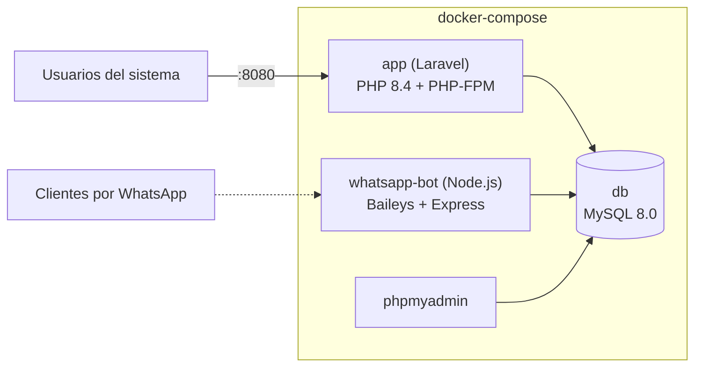

# FusionD3

Sistema todo-en-uno de **punto de venta, inventario, créditos, garantías, auditorías y ventas por WhatsApp** para negocios con una o varias sucursales. Backend en Laravel, frontend integrado con Blade + AdminLTE, y un bot de WhatsApp propio para atender pedidos y catálogo desde el celular.

Pensado para operar 100% en Docker, listo para desplegarse como base y personalizarse por cliente.


---

## ¿Qué incluye?

| Módulo | Qué hace |
|---|---|
| **Punto de venta** | Cobro rápido por producto/servicio, múltiples métodos de pago, notas de venta en PDF |
| **Inventario** | Catálogo de productos, categorías, unidades de compra/venta, control de stock por sucursal |
| **Créditos** | Ventas a crédito con plazos, abonos, límite y días de crédito por cliente |
| **Cartera de clientes** | Alta/edición de clientes, niveles de precio, historial |
| **Caja registradora** | Apertura/cierre de turno, depósitos, retiros, corte de caja |
| **Garantías** | Registro y seguimiento de garantías/devoluciones hasta su resolución |
| **Auditorías** | Conteo físico de inventario por sucursal con reporte en Excel/PDF |
| **Traspasos** | Requisiciones y movimiento de mercancía entre sucursales |
| **Compras** | Registro y autorización de compras a proveedores |
| **WhatsApp Bot** | Catálogo, captura de pedidos y atención a clientes por WhatsApp, con panel de administración (prospectos, quejas, pedidos) |

### Roles

- **Vendedor** — operación diaria: ventas, créditos, garantías, caja, clientes.
- **Encargado / Propietario** — todo lo anterior más gestión de usuarios, configuración, auditorías y alta/edición de clientes.

---

## Arquitectura



- **`app`** — API + vistas del CRM/POS (Laravel 13, PHP 8.4).
- **`whatsapp-bot`** — servicio independiente en Node.js (Baileys) que atiende WhatsApp y se comunica con `app` vía una API interna.
- **`db`** — MySQL compartida entre ambos servicios.
- **`phpmyadmin`** — administración visual de la base de datos.

---

## Puesta en marcha

### Requisitos

- Docker y Docker Compose

### Pasos

```bash
git clone git@github.com:Mounstroya/CRM-Template.git
cd CRM-Template

cp .env.example .env
cp backend/.env.example backend/.env
# Edita backend/.env: genera APP_KEY, y usa las mismas credenciales de DB que pusiste en .env

docker compose build
docker compose up -d

# Dentro del contenedor de la app:
docker compose exec app php artisan key:generate
docker compose exec app php artisan migrate
docker compose exec app php artisan db:seed   # datos de ejemplo (opcional)
```

La app queda disponible en `http://localhost:8080`, el bot de WhatsApp en `http://localhost:2900`, y phpMyAdmin en `http://localhost:8082`.

> El `docker-compose.yml` lee las credenciales/secrets desde el `.env` de la raíz (no está commiteado) — usa `.env.example` como plantilla y genera valores nuevos por cliente/instalación, nunca reutilices los mismos secrets entre despliegues.

### Reconstruir tras un cambio de código

El código del backend y del bot quedan **horneados en la imagen** al hacer build (no hay bind-mount del código fuente). Después de cualquier cambio:

```bash
docker compose build app        # o whatsapp-bot
docker compose up -d app
```

---

## Estructura del repo

```
.
├── backend/          Aplicación Laravel (API + vistas + assets estáticos)
│   ├── app/           Controladores, modelos, middleware, comandos artisan
│   ├── routes/web.php Todas las rutas de la app
│   ├── resources/      Vistas Blade
│   └── database/       Migraciones y seeders
├── whatsapp-bot/      Bot de WhatsApp (Node.js + Baileys)
│   └── src/            Lógica del bot, catálogo, panel, API interna
└── docker-compose.yml Orquestación de los 4 servicios
```

---

## Stack técnico

- **Backend:** Laravel 13, PHP 8.4, MySQL 8.0
- **PDF / Excel:** barryvdh/laravel-dompdf, phpoffice/phpspreadsheet
- **Frontend:** Blade + AdminLTE, jQuery
- **Bot de WhatsApp:** Node.js, @whiskeysockets/baileys, Express, better-sqlite3
- **Infraestructura:** Docker Compose

---

## Licencia

Proyecto propietario. Todos los derechos reservados.
